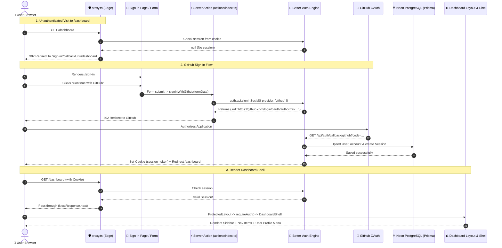

# 🚀 Revu PR Reviewer — Architecture & Code Flow Guide

> **Project:** Revu PR Reviewer (Chai AI Code Reviewer)  
> **Tech Stack:** Next.js 16 (App Router), React 19, Better-Auth, Prisma 7, PostgreSQL (Neon), Tailwind CSS v4, Radix UI  
> **Doc Purpose:** Complete Step-by-Step & Side-by-Side Code Execution Flow

---

## 📑 Table of Contents
1. [High-Level Architecture Overview](#1-high-level-architecture-overview)
2. [Side-by-Side Flow: UI Action vs Code Jump](#2-side-by-side-flow-ui-action-vs-code-jump)
   - [Flow A: Unauthenticated User `/dashboard` visit karta hai](#flow-a-unauthenticated-user-dashboard-visit-karta-hai)
   - [Flow B: User "Continue with GitHub" dabata hai (Login Flow)](#flow-b-user-continue-with-github-dabata-hai-login-flow)
   - [Flow C: Authenticated User `/dashboard` par land karta hai (UI Render Flow)](#flow-c-authenticated-user-dashboard-par-land-karta-hai-ui-render-flow)
   - [Flow D: User "Log out" click karta hai](#flow-d-user-log-out-click-karta-hai)
   - [Flow E: Logged In User wapas `/sign-in` kholta hai](#flow-e-logged-in-user-wapas-sign-in-kholta-hai)
3. [End-to-End Visual Sequence Diagram](#3-end-to-end-visual-sequence-diagram)
4. [File-by-File Responsibility Matrix](#4-file-by-file-responsibility-matrix)

---

## 1. High-Level Architecture Overview

Aapka project **Feature-Driven Architecture** follow karta hai:

```
revu-pr-reviewer/
├── app/                           # Next.js Routing & Layouts
│   ├── (auth)/sign-in/page.tsx    # Sign In Page
│   ├── (protected)/               # Protected Routes (Auth Guard)
│   │   ├── layout.tsx             # Server-side Auth Guard
│   │   └── dashboard/layout.tsx   # Dashboard Shell wrapper
│   ├── api/auth/[...all]/route.ts # Better-Auth API Handler
│   └── layout.tsx                 # Root Layout (Theme & Query Providers)
├── features/                      # Modular Business Logic
│   ├── auth/                      # Authentication Feature Module
│   │   ├── actions/index.ts       # Server Actions (Login, Session, Guards)
│   │   ├── components/            # Sign-In Form, User Menu
│   │   └── utils/                 # Path sanitizers, Proxy logic
│   └── dashboard/                 # Dashboard Feature Module
│       ├── components/            # Sidebar, Shell, Nav Items
│       └── lib/routes.ts          # Nav links configuration
├── lib/                           # Shared Singletons & Configs
│   ├── auth.ts                    # Better-Auth Server Config
│   ├── auth-client.ts             # Better-Auth React Client Hook
│   └── db.ts                      # Prisma Database Singleton
├── prisma/                        # Database Schema & Migrations
│   └── schema.prisma              # User, Session, Account models
└── proxy.ts                       # Next.js 16 Edge Request Interceptor
```

---

## 2. Side-by-Side Flow: UI Action vs Code Jump

---

### Flow A: Unauthenticated User `/dashboard` visit karta hai

Jab koi bina login kiya hua user direct URL me `http://localhost:3000/dashboard` type karta hai:

| Step | User UI par kya dekhta hai | Code background me kahan jump karta hai | File Path & Code Snippet |
| :---: | :--- | :--- | :--- |
| **1** | User browser me `/dashboard` enter karta hai. | Request sabse pehle Next.js ke Edge layer par aati hai. | [`proxy.ts`](file:///c:/Programming/revu-pr-reviewer/proxy.ts) <br> `proxy(request)` trigger hota hai. |
| **2** | Screen par abhi kuch render nahi hua. | `proxy.ts` request ko auth handler me forward karta hai. | [`features/auth/utils/auth-proxy.ts`](file:///c:/Programming/revu-pr-reviewer/features/auth/utils/auth-proxy.ts) <br> `handleAuthProxy(request)` |
| **3** | Browser wait kar raha hai. | Better-Auth check karta hai ki kya request headers me session cookie hai. | `auth.api.getSession({ headers: request.headers })` <br> Result: `null` (No Session). |
| **4** | Browser instantly redirect ho jata hai. | Proxy `redirectToSignIn()` call karta hai aur intended page ko `callbackUrl` me save karta hai. | `NextResponse.redirect("/sign-in?callbackUrl=/dashboard")` |
| **5** | User ko Sign-In card dikhta hai. | Sign-In page render hota hai aur `callbackUrl` form ko pass karta hai. | [`app/(auth)/sign-in/page.tsx`](file:///c:/Programming/revu-pr-reviewer/app/(auth)/sign-in/page.tsx) <br> `<GithubSignInForm callbackUrl="/dashboard" />` |

---

### Flow B: User "Continue with GitHub" dabata hai (Login Flow)

Jab user sign-in page par GitHub button par click karta hai:

| Step | User UI par kya dekhta hai | Code background me kahan jump karta hai | File Path & Code Snippet |
| :---: | :--- | :--- | :--- |
| **1** | User **"Continue with GitHub"** button click karta hai. | Client form submit event trigger karta hai. | [`features/auth/components/github-sign-in-form.tsx`](file:///c:/Programming/revu-pr-reviewer/features/auth/components/github-sign-in-form.tsx) <br> `<form action={signInWithGithub}>` |
| **2** | Button par spinner ghoomta hai aur text banta hai: *"Redirecting to GitHub..."*. | `useFormStatus()` hook `pending = true` detect karta hai aur UI update karta hai. | `SubmitButton()` in `github-sign-in-form.tsx` |
| **3** | Browser server action ke response ka wait karta hai. | Request server action me jump karti hai. Callback URL sanitize hota hai. | [`features/auth/actions/index.ts`](file:///c:/Programming/revu-pr-reviewer/features/auth/actions/index.ts) <br> `signInWithGithub(formData)` <br> `getSafeCallbackPath(callback)` |
| **4** | Server Better-Auth API ko call karta hai. | Better-Auth GitHub OAuth Authorization URL generate karta hai aur state cookie create karta hai. | `auth.api.signInSocial({ provider: "github", callbackURL: "/dashboard", headers })` |
| **5** | Browser redirect hota hai. | Server action `redirect(result.url)` execute karta hai. | `redirect("https://github.com/login/oauth/authorize?...")` |
| **6** | User GitHub Authorization page par pahunchta hai aur **Authorize** click karta hai. | GitHub user ko code ke saath aapke callback endpoint par redirect karta hai. | `GET /api/auth/callback/github?code=...` |
| **7** | Browser loading screen dikhata hai. | Better-Auth ka catch-all route request handle karta hai. | [`app/api/auth/[...all]/route.ts`](file:///c:/Programming/revu-pr-reviewer/app/api/auth/[...all]/route.ts) |
| **8** | Background database update hota hai. | GitHub se token leke Database me `User`, `Account`, aur `Session` create/update karta hai. | [`prisma/schema.prisma`](file:///c:/Programming/revu-pr-reviewer/prisma/schema.prisma) + [`lib/db.ts`](file:///c:/Programming/revu-pr-reviewer/lib/db.ts) |
| **9** | Response browser ko milta hai. | Better Auth browser me encrypted `better-auth.session_token` cookie set karta hai aur `/dashboard` par bhej deta hai. | `Set-Cookie` header + HTTP 302 Redirect to `/dashboard`. |

---

### Flow C: Authenticated User `/dashboard` par land karta hai (UI Render Flow)

Jab login successful hone ke baad user `/dashboard` par aata hai:

| Step | User UI par kya dekhta hai | Code background me kahan jump karta hai | File Path & Code Snippet |
| :---: | :--- | :--- | :--- |
| **1** | Browser `/dashboard` request bhejta hai (session cookie ke saath). | `proxy.ts` request intercept karta hai. Session check hota hai. | [`proxy.ts`](file:///c:/Programming/revu-pr-reviewer/proxy.ts) <br> `session` exists -> `NextResponse.next()` (Allow) |
| **2** | Server-side rendering start hoti hai. | Protected Layout (Layer 2 Auth Guard) execute hota hai. | [`app/(protected)/layout.tsx`](file:///c:/Programming/revu-pr-reviewer/app/(protected)/layout.tsx) <br> `await requireAuth()` |
| **3** | Server session verify karta hai. | `getServerSession()` cookies verify karke DB se user data lata hai. | [`features/auth/actions/index.ts`](file:///c:/Programming/revu-pr-reviewer/features/auth/actions/index.ts) <br> `auth.api.getSession({ headers })` |
| **4** | Layout hierarchy aage badhti hai. | Dashboard Layout execute hota hai aur session user ko Shell component ko deta hai. | [`app/(protected)/dashboard/layout.tsx`](file:///c:/Programming/revu-pr-reviewer/app/(protected)/dashboard/layout.tsx) <br> `<DashboardShell user={session.user} plan="Pro">` |
| **5** | Outer Shell scaffold hota hai. | `TooltipProvider` aur `SidebarProvider` mount hote hain. | [`features/dashboard/components/dashboard-shell.tsx`](file:///c:/Programming/revu-pr-reviewer/features/dashboard/components/dashboard-shell.tsx) |
| **6** | Left me Collapsible Sidebar render hota hai. | Navigation routes config file se load hote hain. | [`features/dashboard/components/dashboard-sidebar.tsx`](file:///c:/Programming/revu-pr-reviewer/features/dashboard/components/dashboard-sidebar.tsx) <br> [`features/dashboard/lib/routes.ts`](file:///c:/Programming/revu-pr-reviewer/features/dashboard/lib/routes.ts) |
| **7** | Sidebar ke bottom me User Profile dikhti hai. | User Avatar, initials, name, aur plan render hota hai. | [`features/dashboard/components/sidebar-user-button.tsx`](file:///c:/Programming/revu-pr-reviewer/features/dashboard/components/sidebar-user-button.tsx) <br> [`features/auth/components/user-menu.tsx`](file:///c:/Programming/revu-pr-reviewer/features/auth/components/user-menu.tsx) |
| **8** | Right side me Main Dashboard Content dikhta hai. | Dashboard page component render hota hai. | [`app/(protected)/dashboard/page.tsx`](file:///c:/Programming/revu-pr-reviewer/app/(protected)/dashboard/page.tsx) |

---

### Flow D: User "Log out" click karta hai

| Step | User UI par kya dekhta hai | Code background me kahan jump karta hai | File Path & Code Snippet |
| :---: | :--- | :--- | :--- |
| **1** | User sidebar me profile button par click karta hai. | Dropdown Menu open hota hai. | [`features/auth/components/user-menu.tsx`](file:///c:/Programming/revu-pr-reviewer/features/auth/components/user-menu.tsx) |
| **2** | User **"Log out"** option click karta hai. | `handleSignOut` function trigger hota hai. | `authClient.signOut()` call hota hai. |
| **3** | Client Better-Auth API ko request bhejta hai. | Session token database se delete hota hai aur browser cookie invalidate hoti hai. | `POST /api/auth/sign-out` via [`lib/auth-client.ts`](file:///c:/Programming/revu-pr-reviewer/lib/auth-client.ts) |
| **4** | Screen reload hokar login page ban jati hai. | Client router user ko login page par push karta hai. | `router.push("/sign-in")` + `router.refresh()` |

---

### Flow E: Logged In User wapas `/sign-in` kholta hai

| Step | User UI par kya dekhta hai | Code background me kahan jump karta hai | File Path & Code Snippet |
| :---: | :--- | :--- | :--- |
| **1** | Logged-in user browser URL me `http://localhost:3000/sign-in` daalta hai. | `proxy.ts` request intercept karta hai. | [`proxy.ts`](file:///c:/Programming/revu-pr-reviewer/proxy.ts) |
| **2** | Screen par sign-in page khulta hi nahi. | Proxy check karta hai: `pathname === "/sign-in"` aur `session` exists. | [`features/auth/utils/auth-proxy.ts`](file:///c:/Programming/revu-pr-reviewer/features/auth/utils/auth-proxy.ts) |
| **3** | User instantly dashboard par wapas bounce ho jata hai. | Proxy turant redirect response bhej deta hai. | `NextResponse.redirect("/dashboard")` |

---

## 3. End-to-End Visual Sequence Diagram



---

## 4. File-by-File Responsibility Matrix

| File Path | Role & Responsibility | Key Functions / Components |
| :--- | :--- | :--- |
| [`proxy.ts`](file:///c:/Programming/revu-pr-reviewer/proxy.ts) | **Edge Interceptor:** Har matched request ko page render hone se pehle check karta hai. | `proxy(request)`, matcher config |
| [`features/auth/utils/auth-proxy.ts`](file:///c:/Programming/revu-pr-reviewer/features/auth/utils/auth-proxy.ts) | **Proxy Logic:** Logged out user ko login par aur logged in user ko dashboard par redirect karta hai. | `handleAuthProxy()`, `redirectToSignIn()` |
| [`features/auth/actions/index.ts`](file:///c:/Programming/revu-pr-reviewer/features/auth/actions/index.ts) | **Server Actions:** Secure backend operations (GitHub login, session reading, route guards). | `signInWithGithub()`, `requireAuth()`, `getServerSession()` |
| [`lib/auth.ts`](file:///c:/Programming/revu-pr-reviewer/lib/auth.ts) | **Server Auth Config:** Prisma adapter, GitHub credentials, aur Next.js cookie plugin initialize karta hai. | `betterAuth({...})` singleton |
| [`lib/auth-client.ts`](file:///c:/Programming/revu-pr-reviewer/lib/auth-client.ts) | **Client Auth Client:** Frontend hooks provide karta hai (`useSession`, `signOut`). | `createAuthClient()` |
| [`lib/db.ts`](file:///c:/Programming/revu-pr-reviewer/lib/db.ts) | **Database Client:** Prisma connection pooler ka single global instance rakhta hai. | `prisma` instance singleton |
| [`prisma/schema.prisma`](file:///c:/Programming/revu-pr-reviewer/prisma/schema.prisma) | **Database Schema:** `User`, `Session`, `Account`, `Verification` tables ka blueprint. | Models & Relations |
| [`app/(protected)/layout.tsx`](file:///c:/Programming/revu-pr-reviewer/app/(protected)/layout.tsx) | **Layer 2 Security Guard:** Ensure karta hai ki koi bhi page bina session ke render na ho sake. | `await requireAuth()` |
| [`app/(protected)/dashboard/layout.tsx`](file:///c:/Programming/revu-pr-reviewer/app/(protected)/dashboard/layout.tsx) | **Dashboard Wrapper:** User session nikaal kar UI Shell ko provide karta hai. | `<DashboardShell user={session.user} plan="Pro" />` |
| [`features/dashboard/components/dashboard-shell.tsx`](file:///c:/Programming/revu-pr-reviewer/features/dashboard/components/dashboard-shell.tsx) | **UI Shell:** Sidebar aur main content area ko coordinate karta hai. | `SidebarProvider`, `DashboardSidebar`, `SidebarInset` |
| [`features/dashboard/lib/routes.ts`](file:///c:/Programming/revu-pr-reviewer/features/dashboard/lib/routes.ts) | **Routes Definition:** Dashboard ke 5 main navigation links define karta hai. | `DASHBOARD_ROUTES`, `DASHBOARD_NAV_ITEMS` |
| [`features/auth/components/user-menu.tsx`](file:///c:/Programming/revu-pr-reviewer/features/auth/components/user-menu.tsx) | **User Profile Dropdown:** User name, avatar, badge aur Logout action handle karta hai. | `<UserMenu />`, `handleSignOut()` |